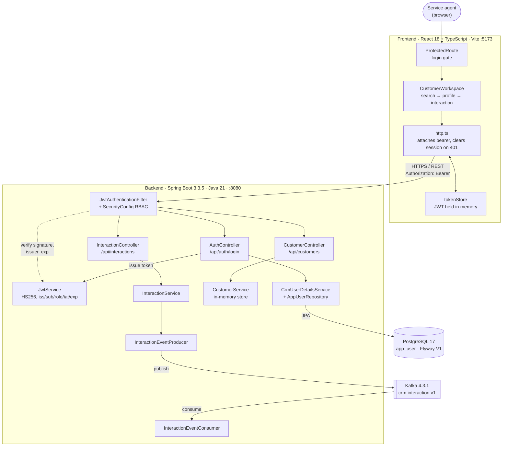
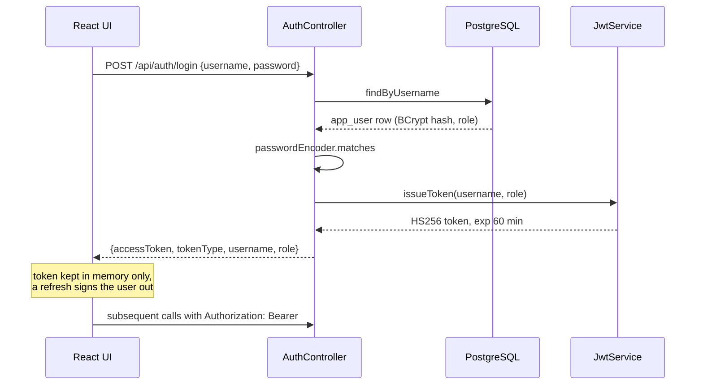

# Architecture

What the system is today, not what it is planned to become. Anything not yet
built is listed under [Gaps](#gaps) rather than drawn as if it exists.

## Container view

## Request paths

| Path | Public | AGENT | ADMIN |
| ---- | ------ | ----- | ----- |
| `/api/auth/login` | ✅ | ✅ | ✅ |
| `/actuator/health` and probes | ✅ | ✅ | ✅ |
| `/api/customers/**` | ❌ | ✅ | ✅ |
| `/api/interactions/**` | ❌ | ✅ | ✅ |
| `/api/admin/**` | ❌ | ❌ 403 | ✅ |
| anything else | ❌ | authenticated | authenticated |

## Authentication flow

Unknown username and wrong password return the same 401, so the endpoint cannot
be used to enumerate accounts. A federated account has a null `password_hash`,
which can never satisfy a BCrypt check.

## Persistence

`app_user` is the only table so far. `password_hash` is nullable and `email` is
present from the first migration, so an external identity provider slots in
without a schema change.

| Column | Notes |
| ------ | ----- |
| `username` | unique, business key |
| `email` | unique, indexed — lookup key for federated sign-in |
| `password_hash` | BCrypt; null for federated accounts |
| `role` | `AGENT` or `ADMIN`, enforced by a check constraint |
| `enabled` | disables an account without deleting it |

The migration is deliberately portable SQL. It runs against PostgreSQL in
normal operation and against H2 in PostgreSQL mode under test, so the schema the
tests exercise is the schema that ships.

## Gaps

Not yet built, listed so the diagram is not read as a plan:

- **Customers and interactions are still in memory.** `CustomerRepository` is a
  `ConcurrentHashMap` and holds a TODO to become a JPA repository. Only
  authentication is persisted.
- **No frontend route for interactions reaches the backend.** The UI posts to
  `/api/customers/{id}/interactions` with `{channel, summary}`; the API serves
  `/api/interactions` with `{customerId, channel, notes}`. Every attempt 404s.
- **No `/api/admin` handler.** The RBAC rule exists and is tested, but nothing is
  mapped beneath it.
- **No CI pipeline, container image, or Kubernetes manifests.** `k8s/` and
  `infra/` do not exist yet.
- **A missing route returns 500, not 404.** The catch-all
  `@ExceptionHandler(Exception.class)` swallows Spring's `NoResourceFoundException`
  and reports it as a server error, leaking the requested path.
