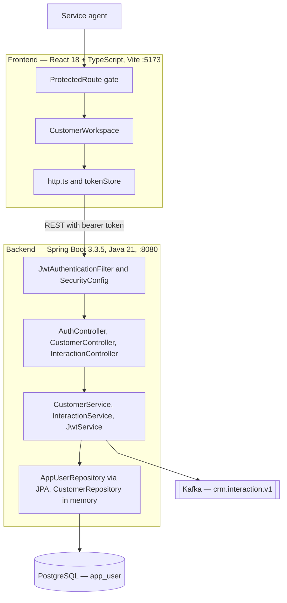
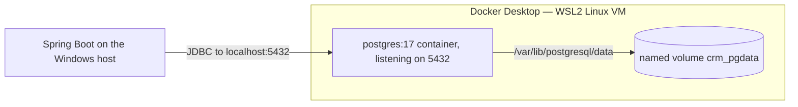
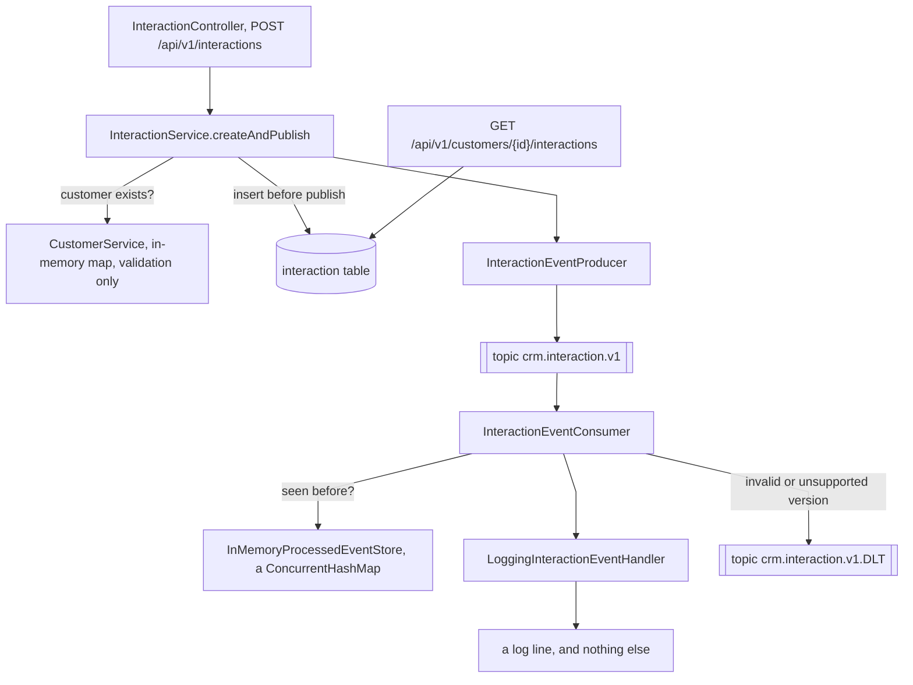
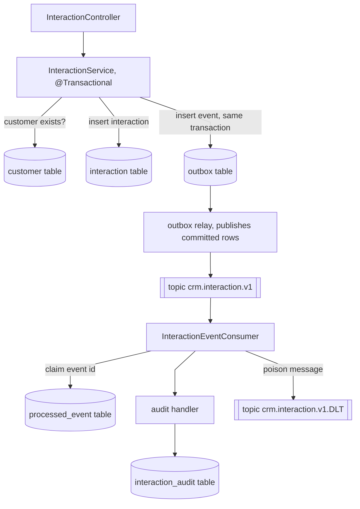
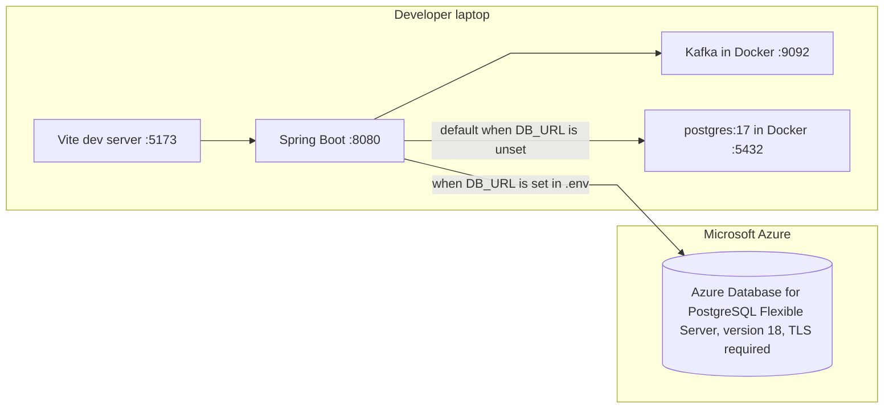

# Architecture

What the system is today, not what it is planned to become. Anything not yet
built is listed under [Gaps](#gaps) rather than drawn as if it exists.

Start with the [system context view](architecture/context.md) for the CRM as one
box, its external participants, and its trust boundaries. The views below open
that box to show its containers, request paths, messaging, persistence, and
deployment.

## Container view

## Request paths

| Path | Public | AGENT | ADMIN |
| ---- | ------ | ----- | ----- |
| `/api/v1/auth/login` | ✅ | ✅ | ✅ |
| `/actuator/health` and probes | ✅ | ✅ | ✅ |
| `/api/v1/customers/**` | ❌ | ✅ | ✅ |
| `/api/v1/interactions/**` | ❌ | ✅ | ✅ |
| `/api/v1/admin/**` | ❌ | ❌ 403 | ✅ |
| anything else | ❌ | authenticated | authenticated |

## Authentication flow

Unknown username and wrong password return the same 401, so the endpoint cannot
be used to enumerate accounts. A federated account has a null `password_hash`,
which can never satisfy a BCrypt check.

## Where the local database actually lives

It is a Docker container, not a file in the repository and not anything in the
browser. Nothing about it touches `localStorage` — that is browser storage, a
different thing entirely, and the only thing the app keeps there is nothing at
all (the JWT is held in memory).

The volume's reported mountpoint is
`/var/lib/docker/volumes/java-bootcamp-capstone_crm_pgdata/_data`. That is a path
*inside the Linux VM*, not a Windows directory — the real bytes sit in the WSL2
virtual disk that Docker Desktop manages.

Consequences worth knowing:

| Action | Data |
| ------ | ---- |
| `docker compose stop` / restart | kept |
| `docker compose down` | kept — the volume outlives the container |
| `docker compose down -v` | **destroyed** — the volume is deleted |
| Deleting the repository | kept — the volume is not in the working tree |
| `mvn test` | untouched — tests run on in-memory H2 |

The container currently holds `app_user`, `interaction`, and
`flyway_schema_history`. Flyway creates and tracks them, so a wiped volume rebuilds itself on the next
startup and the seeder re-adds `agent1` and `admin1`.

## Messaging: today and the target

### Today

The synchronous path now validates the customer, saves the interaction, and
publishes its event. A nested GET reads the durable row back for the customer.
The remaining messaging gaps are the outbox and a durable consumer side effect.

### Target

The first high-value change—writing the interaction inside a transaction before
publishing—is complete. The target still adds an outbox and gives the consumer
a durable side effect so its idempotency guarantee protects something real.

### What changes, and why

| | Today | Target | Why |
| ---- | ----- | ------ | --- |
| Interaction record | row in `interaction`, written before publishing and exposed by GET | keep this behavior | The create endpoint returns `201 Created`, and the browser journey independently verifies persistence by reading the interaction back. |
| Customer lookup | in-memory map | `customer` table | Survives a restart. Also what Lab 50's UI-to-database flow needs. |
| Publish | directly from the service | outbox row, published by a relay | Writing the row and publishing separately is a dual write: the transaction can commit and the publish fail, leaving the database and the log disagreeing. One transaction removes the gap. |
| Idempotency store | `ConcurrentHashMap` | `processed_event` table | Per-JVM state is per-replica state. With more than one pod, each has its own set, and the exactly-once guarantee stops holding. |
| Consumer effect | a log line | a durable audit row | Reprocessing a log statement costs nothing, so idempotency currently protects nothing. Give the consumer a real side effect and the guarantee starts to matter. |

The outbox is the part worth naming in the defense even if it is not built. When
a sponsor asks "what happens if Kafka is down when you save?", the honest answer
today is that the save succeeds and the event is lost. The outbox is why that
question has a good answer.

An intermediate step is legitimate: write the interaction row and publish
directly, accepting the dual write and documenting it as residual risk. That
alone closes the persistence gap, which is the part that is scored.

## Deployment

The container view above is deliberately environment-agnostic. This is where the
same containers get mapped onto machines.

Only the database has moved to Azure. The API, the UI and Kafka all still run on
a developer laptop, so there is no deployed application yet — just a hosted
database that a local application can point at.

Which database is used is decided entirely by `.env`. Nothing in the committed
configuration names the Azure server, and the same build runs against either.

| | Local | Azure |
| ---- | ----- | ----- |
| Chosen by | defaults in `application.yml` | `DB_URL`, `DB_USER`, `DB_PASSWORD` in `.env` |
| PostgreSQL version | 17 | 18 |
| Transport | plaintext on localhost | TLS 1.2, `sslmode=require` |
| Schema created by | Flyway on first start | Flyway on first start |
| Used by tests | no — tests use H2, except `AppUserRepositoryIT` which pins localhost | never |

## Persistence

`app_user` is the only table so far. `password_hash` is nullable and `email` is
present from the first migration, so an external identity provider slots in
without a schema change.

| Column | Notes |
| ------ | ----- |
| `username` | unique, business key |
| `email` | unique, indexed — lookup key for federated sign-in |
| `password_hash` | BCrypt; null for federated accounts |
| `role` | `AGENT` or `ADMIN`, enforced by a check constraint |
| `enabled` | disables an account without deleting it |

The migration is deliberately portable SQL. It runs against PostgreSQL in
normal operation and against H2 in PostgreSQL mode under test, so the schema the
tests exercise is the schema that ships.

## Gaps

Not yet built, listed so the diagram is not read as a plan:

- **Customers are still in memory.** `CustomerRepository` is a
  `ConcurrentHashMap`, so interaction rows use an indexed customer business key
  until the customer table exists and can provide a foreign key.
- **The publish is still a dual write.** The interaction row and direct Kafka
  send are not one atomic resource; the outbox shown above remains the target.
- **Consumer idempotency is still in memory.** It protects a log statement, not
  a durable audit row.
- **Nothing deploys from the pipeline yet.** The container image is built and
  checked on every pull request — `backend/Dockerfile`, hadolint,
  container-structure-test, trivy, and `ContainerImageIT` — but no job publishes
  it to a registry or applies it to a cluster.
