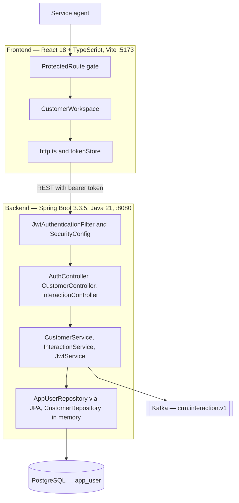
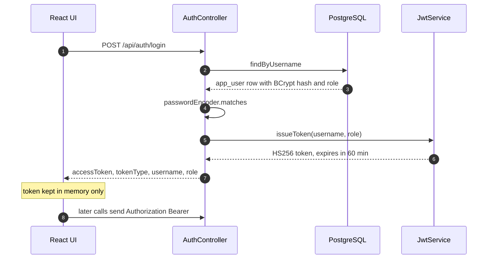
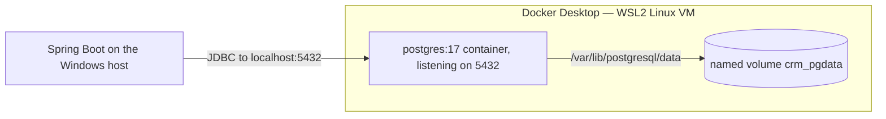
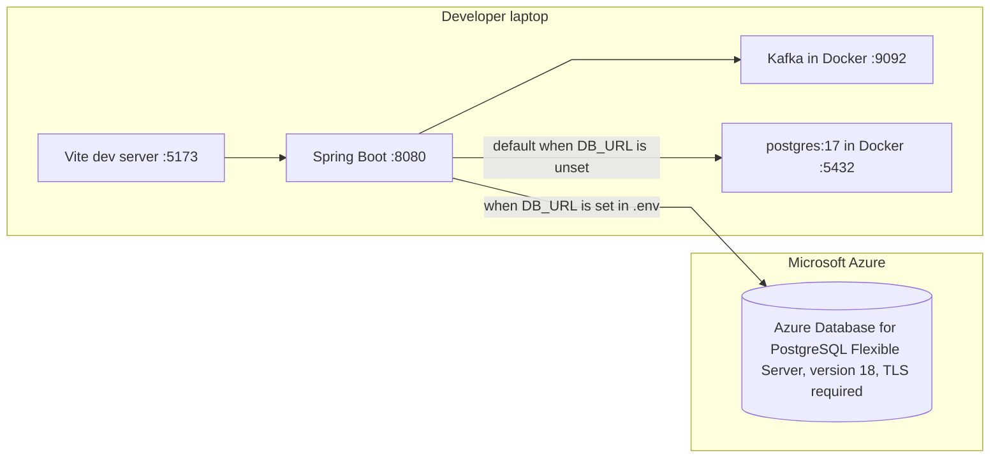

# Architecture

What the system is today, not what it is planned to become. Anything not yet
built is listed under [Gaps](#gaps) rather than drawn as if it exists.

## Container view

## Request paths

| Path | Public | AGENT | ADMIN |
| ---- | ------ | ----- | ----- |
| `/api/auth/login` | ✅ | ✅ | ✅ |
| `/actuator/health` and probes | ✅ | ✅ | ✅ |
| `/api/customers/**` | ❌ | ✅ | ✅ |
| `/api/interactions/**` | ❌ | ✅ | ✅ |
| `/api/admin/**` | ❌ | ❌ 403 | ✅ |
| anything else | ❌ | authenticated | authenticated |

## Authentication flow

Unknown username and wrong password return the same 401, so the endpoint cannot
be used to enumerate accounts. A federated account has a null `password_hash`,
which can never satisfy a BCrypt check.

## Where the local database actually lives

It is a Docker container, not a file in the repository and not anything in the
browser. Nothing about it touches `localStorage` — that is browser storage, a
different thing entirely, and the only thing the app keeps there is nothing at
all (the JWT is held in memory).

The volume's reported mountpoint is
`/var/lib/docker/volumes/java-bootcamp-capstone_crm_pgdata/_data`. That is a path
*inside the Linux VM*, not a Windows directory — the real bytes sit in the WSL2
virtual disk that Docker Desktop manages.

Consequences worth knowing:

| Action | Data |
| ------ | ---- |
| `docker compose stop` / restart | kept |
| `docker compose down` | kept — the volume outlives the container |
| `docker compose down -v` | **destroyed** — the volume is deleted |
| Deleting the repository | kept — the volume is not in the working tree |
| `mvn test` | untouched — tests run on in-memory H2 |

The container currently holds two tables: `app_user` and `flyway_schema_history`.
Flyway creates and tracks both, so a wiped volume rebuilds itself on the next
startup and the seeder re-adds `agent1` and `admin1`.

## Deployment

The container view above is deliberately environment-agnostic. This is where the
same containers get mapped onto machines.

Only the database has moved to Azure. The API, the UI and Kafka all still run on
a developer laptop, so there is no deployed application yet — just a hosted
database that a local application can point at.

Which database is used is decided entirely by `.env`. Nothing in the committed
configuration names the Azure server, and the same build runs against either.

| | Local | Azure |
| ---- | ----- | ----- |
| Chosen by | defaults in `application.yml` | `DB_URL`, `DB_USER`, `DB_PASSWORD` in `.env` |
| PostgreSQL version | 17 | 18 |
| Transport | plaintext on localhost | TLS 1.2, `sslmode=require` |
| Schema created by | Flyway on first start | Flyway on first start |
| Used by tests | no — tests use H2, except `AppUserRepositoryIT` which pins localhost | never |

## Persistence

`app_user` is the only table so far. `password_hash` is nullable and `email` is
present from the first migration, so an external identity provider slots in
without a schema change.

| Column | Notes |
| ------ | ----- |
| `username` | unique, business key |
| `email` | unique, indexed — lookup key for federated sign-in |
| `password_hash` | BCrypt; null for federated accounts |
| `role` | `AGENT` or `ADMIN`, enforced by a check constraint |
| `enabled` | disables an account without deleting it |

The migration is deliberately portable SQL. It runs against PostgreSQL in
normal operation and against H2 in PostgreSQL mode under test, so the schema the
tests exercise is the schema that ships.

## Gaps

Not yet built, listed so the diagram is not read as a plan:

- **Customers and interactions are still in memory.** `CustomerRepository` is a
  `ConcurrentHashMap` and holds a TODO to become a JPA repository. Only
  authentication is persisted.
- **No frontend route for interactions reaches the backend.** The UI posts to
  `/api/customers/{id}/interactions` with `{channel, summary}`; the API serves
  `/api/interactions` with `{customerId, channel, notes}`. Every attempt 404s.
- **No `/api/admin` handler.** The RBAC rule exists and is tested, but nothing is
  mapped beneath it.
- **No CI pipeline, container image, or Kubernetes manifests.** `k8s/` and
  `infra/` do not exist yet.
- **A missing route returns 500, not 404.** The catch-all
  `@ExceptionHandler(Exception.class)` swallows Spring's `NoResourceFoundException`
  and reports it as a server error, leaking the requested path.
