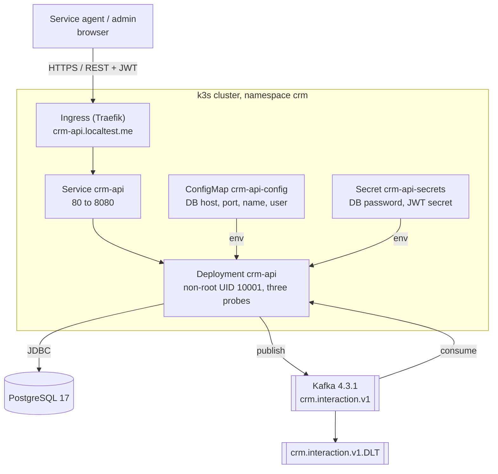

# Container view

What is deployed, what talks to what, and where credentials come from.

## Units

| Container | What it is | Notes |
| --------- | ---------- | ----- |
| React frontend | Vite, Node 22 | Sets `X-Correlation-ID` on every call |
| Spring Boot API | Java 21, one jar | JWT filter, service layer, JPA, Kafka producer and consumer |
| PostgreSQL | `postgres:17` | Schema owned by Flyway |
| Kafka | `apache/kafka:4.3.1` | Topic `crm.interaction.v1`, dead letter `.DLT` |

## Configuration and secrets

Nothing that is secret is in a file git can see.

| Value | Comes from |
| ----- | ---------- |
| DB host, port, name, user | ConfigMap `crm-api-config` |
| DB password, JWT secret | Secret `crm-api-secrets`, created from the command line |
| Local development | gitignored `.env`, loaded by `spring.config.import` |

`k8s/examples/secret.example.yaml` records which keys the Secret must carry. It
lives under `examples/` because `kubectl apply -f k8s/` would otherwise apply it
and overwrite a working Secret with placeholders.

## Profiles

| Profile | Database |
| ------- | -------- |
| `local` (default) | PostgreSQL via `.env` |
| `azure` | Azure PostgreSQL Flexible Server |
| `test` | H2 in PostgreSQL mode, plus Testcontainers for the integration suite |

## Deploy path

`git push` to GitHub Actions, which builds and tests, builds the image, validates
the manifests, then creates a cluster and deploys them. See
`.github/workflows/ci.yml` and `docs/rollback-runbook.md`.
