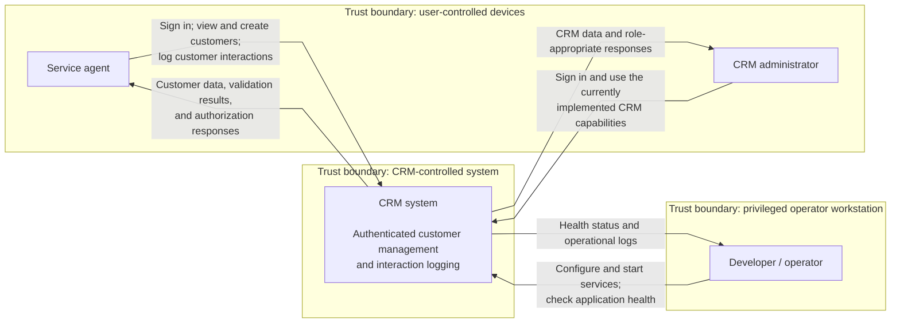

# System context

This is the current CRM system viewed as one opaque box. It shows who
communicates with the system, why they do so, and where trust changes. It does
not show the frontend, backend, database, or Kafka separately; those belong in
the [container view](../architecture.md#container-view).

The boundaries are logical trust and responsibility boundaries, not necessarily
different physical machines. In local development, several of these elements
can run on the same laptop and the boundaries still apply.

## Participants and relationships

| Participant | Relationship with the CRM | Authentication and trust notes |
| ----------- | ------------------------- | ------------------------------ |
| Service agent | Signs in, reads and creates customers, and submits customer interactions. | Login accepts credentials and returns a JWT. Customer and interaction requests require an `AGENT` or `ADMIN` token. All browser input is treated as untrusted and validated by the API. |
| CRM administrator | Signs in and can use the implemented agent-facing capabilities with the `ADMIN` role. | The role is enforced by backend authorization. `/api/v1/admin/**` is reserved for administrators, but no admin handler exists yet, so this view does not claim any administrative feature beyond the current access rule. |
| Developer / operator | Supplies runtime configuration, starts the application and supporting services, checks health, and reads logs. | This is privileged access because configuration can contain secrets. The basic health response is public; health details require authorization. |

## What is inside the system boundary

The CRM system boundary includes the React frontend, Spring Boot API, Kafka
messaging, and CRM-owned data stores. They are intentionally hidden at this
level. PostgreSQL remains inside the logical system boundary whether it runs in
the local Docker environment or on the team's Azure PostgreSQL server; its
physical deployment and network boundary are shown in the
[deployment view](../architecture.md#deployment).

There is currently no external identity provider or other third-party business
system connected to the CRM. Planned infrastructure and integrations are not
shown as if they already exist.

## Boundary implications

- Traffic from a user-controlled device crosses into the CRM trust boundary.
  Login and the basic health probes are public entry points; customer,
  interaction, and reserved admin paths are authorization-controlled.
- The browser receives a bearer token after login. The frontend holds it in
  memory and sends it in the `Authorization` header on protected API requests.
- Operator configuration crosses a privileged boundary and can include database
  credentials and the JWT signing secret. These values belong in local or
  deployment environment configuration, not in the repository.
- Local development currently uses HTTP. This diagram does not imply that TLS or
  a production ingress has already been deployed.
