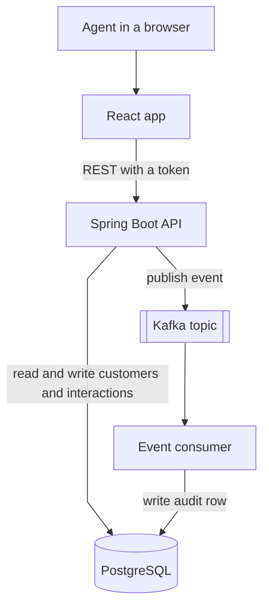
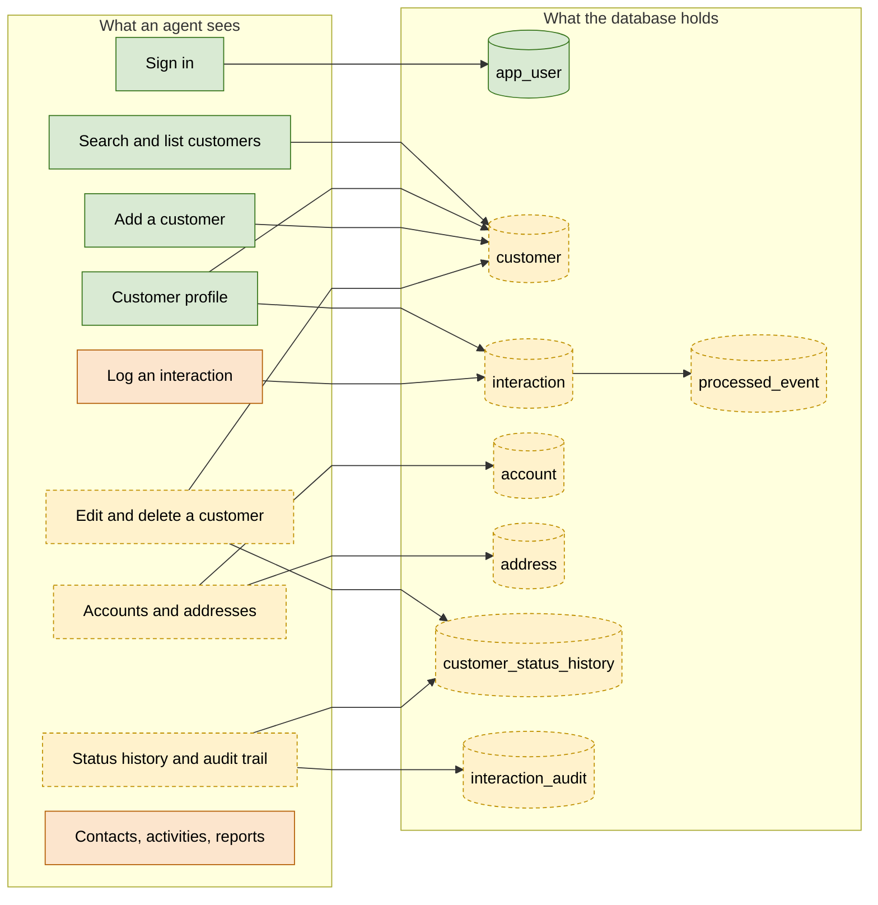
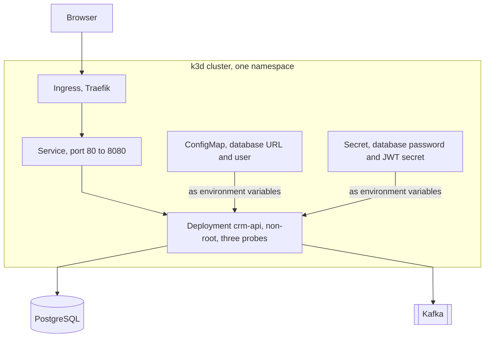
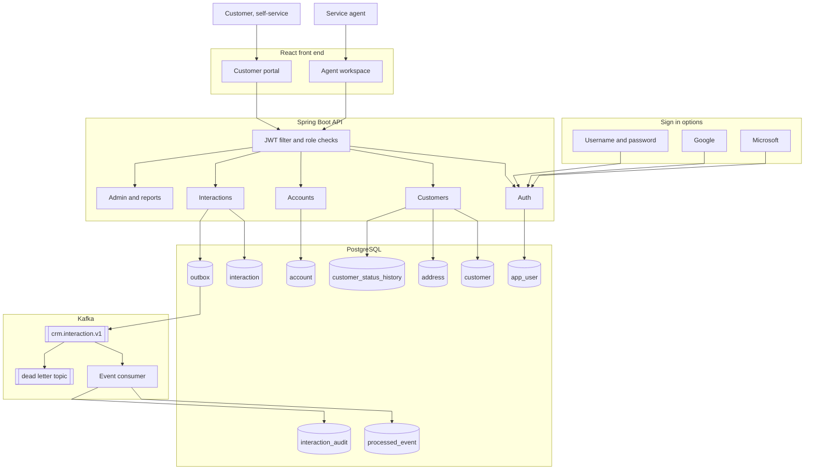

# Build plan

A starting point for discussion, not a decision. Every name below is a
suggestion — swap them around if the split feels wrong.

## What we are building

**Every box already exists. The two arrows into the database do not.** Customers
sit in memory and vanish on restart. Interactions are published to Kafka and
never saved at all. That is the main gap.

The whole thing then runs as containers, deployed twice: to k3s on a laptop for
the rubric, and to Azure for a live demo link.

## Where we are now

This describes `develop` plus the `postgres-database` branch waiting to merge
into it. Neither `main` nor `develop` has the database work yet.

| Part | State |
| ---- | ----- |
| Login and roles | Done. Real JWT, users stored in PostgreSQL |
| Front end | Nine screens, sidebar, sign-out. Three run on demo data |
| Customers | Create, read, list. No update or delete. Lost on restart |
| Interactions | Create only. Never saved, and no way to read them back |
| Kafka | Sends and receives. The consumer only writes a log line |
| Database | One table, `app_user` |
| Containers, CI, Kubernetes | None |
| Deployed | Only the database, on Azure |

## Tables and screens: what exists, what has to be built

The only thing we persist today is the list of people who can log in. Everything
an agent actually does is either in memory or nowhere.

Green works today. Orange half-works. Dashed is to build. Two things the picture
makes obvious:

- **Every green screen except sign-in points at a table that does not exist.**
  Search, profile and add-a-customer all work against a `ConcurrentHashMap`, which
  is exactly why they empty out on restart.
- **The orange ones are honest about themselves.** Logging an interaction posts
  correctly and returns 202, but nothing is stored and there is no GET to read it
  back, so the timeline only survives until you navigate away. Contacts,
  activities and reports are Himank's mock screens — each one carries a
  "Demo data" tag in the UI because no endpoint exists behind it.

Every dashed table is a full vertical slice, not just a migration:

| Table | Entity | Repository | Service | DTO | API | Screen |
| ----- | ------ | ---------- | ------- | --- | --- | ------ |
| `app_user` | yes | yes | yes | yes | login | login |
| `customer` | plain class, not `@Entity` | in-memory map | create, get, list | yes | 3 routes of 6 | list, profile, add — edit disabled, no `PUT` to call |
| `interaction` | none | none | publishes, never saves | request only | POST only | posts correctly, timeline is local state |
| `account`, `address` | none | none | none | none | none | none |
| `customer_status_history` | none | none | none | none | none | none |
| `interaction_audit`, `processed_event` | none | in memory | consumer logs a line | none | none | none |

Three things that follow from the table:

- **`customer` is the template.** Whoever does it first works out the pattern —
  migration, entity, `JpaRepository`, service, DTOs, controller, screen — and
  everyone else copies it. Worth doing carefully and together.
- **The right-hand columns are where we are thinnest.** We have more schema ideas
  than screens. A table nobody can reach from the UI proves nothing in a demo.
- **`account`, `address` and `customer_status_history` are lab 41's schema**, so
  they are copy-and-adapt rather than design work. They are what turns this from
  a contact list into a CRM: a customer with accounts, addresses, and a record of
  how their status changed and who changed it.

## Phases

The order matters. Each line says why it sits where it does.

**Phase 1 — Save the data.** Right now only `app_user` is a real table.
Concretely, this phase means:

- `V2__customer.sql` and `V3__interaction.sql`, written in the same portable SQL
  style as `V1__app_user.sql` so they run on PostgreSQL and on H2 under test
- `Customer` becomes a JPA `@Entity`; `CustomerRepository` becomes a
  `JpaRepository<Customer, String>` instead of a `ConcurrentHashMap`
- An `Interaction` entity and repository, with `InteractionService` made
  `@Transactional` so the row is saved before the event is published
- `CustomerService.seedDemoCustomers()` made idempotent — it currently calls
  `save()` on every startup, which against a real database overwrites CUS-1001
  and CUS-1002, including mid-demo
- One repository integration test per new table, copied from
  `AppUserRepositoryIT`, which already runs against real PostgreSQL rather than H2
- `InMemoryProcessedEventStore` moved to a `processed_event` table

The entity and its migration must land in the same commit. `ddl-auto: validate`
means the app refuses to start if they disagree — deliberately, but it surprises
people who split the work.

**Phase 2 — Set up the pipeline.** It needs
nothing from anyone else, so it can start today.

**Phase 3 — Finish CRUD.** Update, delete, and list interactions, with screens
for each. Needs Phase 1.

**Phase 4 — Build an image.** One Dockerfile, runs the same anywhere.

**Phase 5 — Kubernetes.** Deploy to k3s with health checks, a smoke test, and a
rollback. All three are graded, not optional.

**Phase 6 — Azure.** Same image in the cloud, public URL for the demo.

## What Kubernetes will look like

Phase 5 in a picture. The object list comes from Luke's `lab42-manifest-map.md`,
so it matches what the lab already taught rather than something new.

The Secret is created from the command line and never committed — the same rule
`.env` already follows. The ConfigMap holds only things that are safe to read.

## For Lab material incorporated in this project so far

Review lab-coverage.md

## What "done" means

Same bar for every task on the list:

1. Tests pass — `mvn verify` in `backend`, or `npm run test:ci` in `frontend`
   (plain `npm test` is watch mode and never exits)
2. Any doc the change affects is updated in the same PR
3. Someone else reviewed it

`node scripts/verify-setup.mjs` is deliberately not on this list. It needs
PostgreSQL, Kafka, the API and Vite all running at once, which is the right check
before a demo and the wrong one before a two-line PR.

## Things that will trip us up

- **Add the table and the entity in the same commit.** The app checks them
  against each other at startup and refuses to run if they disagree.
- **Never commit passwords.** They live in `.env`, which git ignores. Docker and
  Spring both read that same file.
- **Changing `LOCAL_DB_PASSWORD` needs `docker compose down -v` first.**
  PostgreSQL only reads that value when the data folder is empty, so editing
  `.env` alone leaves the old password in place.
- **When something will not start, run `node scripts/verify-setup.mjs`.** It
  checks the whole stack and names the one thing that is wrong, which is faster
  than guessing. Worth running before a demo, and after pulling a change that
  touches config.

## The full picture, if we had time

Not a commitment. This is what the system would look like with everything the
course covered, so we can see what we are choosing not to build.

Three things worth understanding from it:

- **Three ways to sign in, one set of rules.** Password, Google, or Microsoft all
  end at the same place: our own token carrying our own roles. The provider says
  who you are; we decide what you may do. Adding a provider does not change any
  route or any role check.
- **The customer tables are lab 41's schema** — `customer`, `account`, `address`,
  `customer_status_history`. Taking them as-is means status changes get recorded
  as they happen rather than reconstructed later.
- **The outbox** makes "saved" and "published" one decision instead of two that
  can disagree. Without it, the database can commit while the event is lost, and
  nothing notices.

Most likely to be cut, and fine to cut: the customer portal, and one or both
OAuth providers. Both are real work and neither is required by the rubric.
